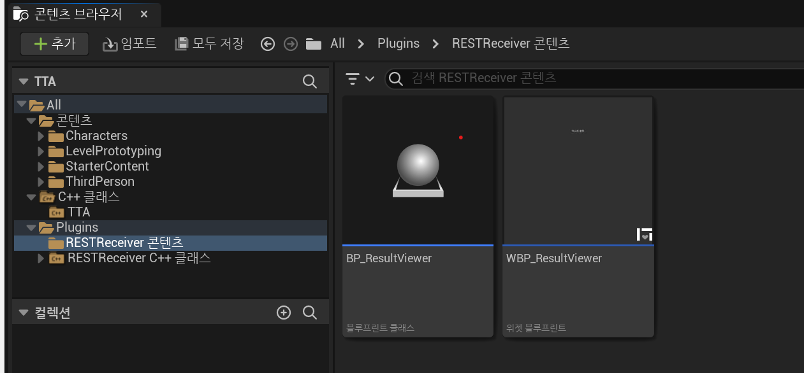

# How to Use

먼저, BP_ResultViewer 액터를 맵에 배치하십시오. 이후 오버랩 이벤트를 생성하는 액터로 배치한 액터와 오버랩되면 Http request goes here 는 20으로 바뀝니다. 현재 API 는 "https://api.itbook.store/1.0/new" 를 사용했으며 total 파라미터를 읽어오도록하였습니다 :) 

작업과정은 다음과 같습니다 

1. Http 리퀘스트를 처리할 수 있는 액터를 구현(HttpReceiver)
2. 위젯 블루프린트에서 상속 받을 수 있는 user widget 클래스 생성 (UHttpViewer)
3. 이후 블루프린트에서 UHttpViewer를 상속받은 뒤 텍스트블록 변수와 바인딩. 
4. 리퀘스트 전송은 오버랩 이벤트가 발생할 시
5. 리퀘스트 수신은 바인딩된 델리게이트 함수가 실행되면 블루프린트에서 구현한 이벤트로 결과를 쏘도록함. 
6. ResultViewer의 세팅을 변경. 

